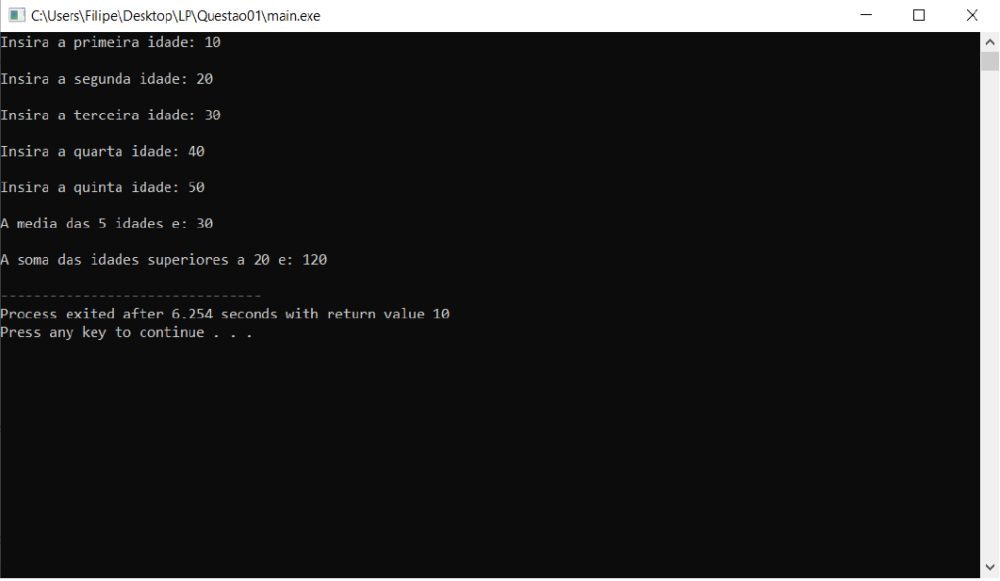

# Soma-Média
### Utilização de média e soma com idades introduzidas pelo utilizador 
Trabalho desenvolvido para cimentar os conhecimentos adquiridos nas cadeiras de Linguagens de Programação e Algoritmos e Estruturas de Dados.

**O objetivo da aplicação consiste em solicitar a idade de 5 pessoas, apresente a média dessas idades e a soma das idades introduzidas acima dos 20 anos.**

Se quiser utilizar o programa basta:
* Executar o ficheiro denominado "main.exe".

Aqui tem um exemplo do programa em execução:

